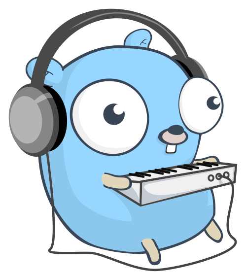

% 自己紹介
% Takumi
% 4/11/2020

----
 
## whoami
<div class="license" stlye="font-size:10%;">
  
<span>The Go Gopher was designed by Renee French. This was made by @egonelbre.
Under CC0 license.</span>
</div>

```json
{
  "name": "Takumi",
  "github": "@takumi34",
  "favarites": [ "Golang", "Arch Linux" ],
  "blog":"takumi34.github.io"
}
```


----

## 経歴
* 慶應法学部法律学科卒
  * 法哲学をやっていた
  * 正義とはなにか?

* Githubアカウント: @takumi34
* [ブログ](https://takumi34.github.io/)

----

## 技術スタック
* 基本的にはサーバサイド
  * GoとかgRPCをやっています(やりたい)
* なぜかこの前まではAngularをやっていた
  * TypeScriptを書いて、HTMLとCSSとをにらめっこする毎日
* その前はSpringBoot

----

## プライベート
* C++を主に書いている
    * (アルゴリズム特化なのでC++はよく分かってない）
* Dartもたまに書く
    * ただマシンスペックが低くてFlutterのビルドに時間かかるので嫌
* 最近はOSあたりの低レイヤにも興味あり(プログラミング言語処理系にも興味があるらしい)

----

## 開発環境

* PC: thinkpad x1 carbon
* OS: ubuntu 19.10（arch linuxに移行したいと言いながらはや数年)
* Editor: Neovim(と言いながら最近はVSCodeを使っている)

----
 
## アジャイル開発が好き
* ペアプロ
* モブプロ ← 四六時中やりたい
* TDD

----

## 近況報告
* 在宅勤務生産性向上のために椅子を買った
    * [エルゴヒューマンプロ](https://www.ergohuman.jp/product/ergohuman_pro_ottoman.php) 約10万円のオフィスチェア
* LGの曲面ディスプレイも買いたい(約13万円)


